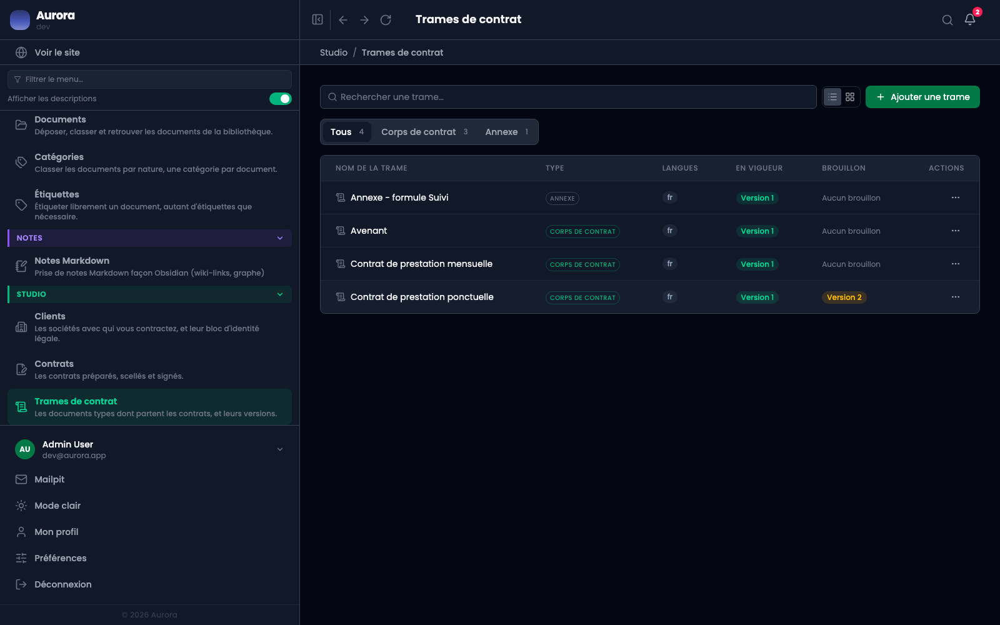
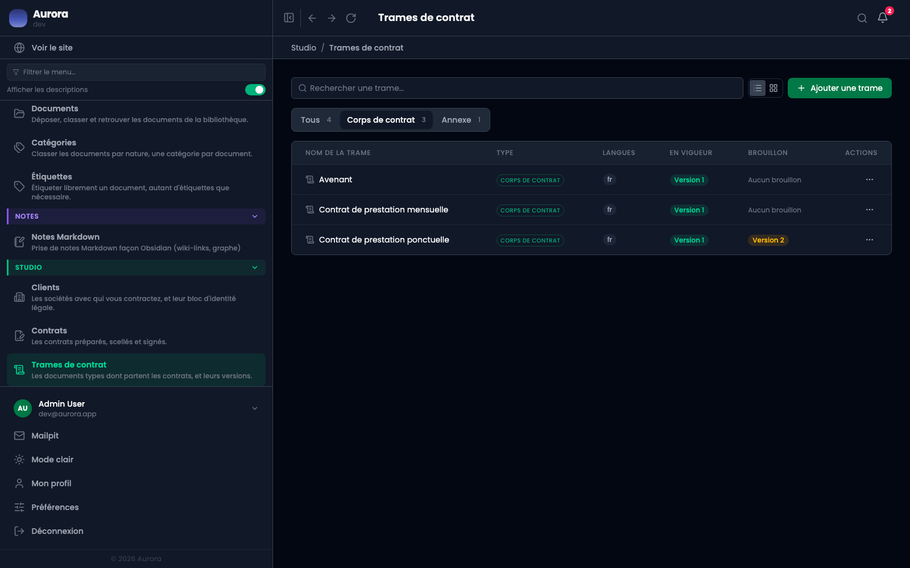
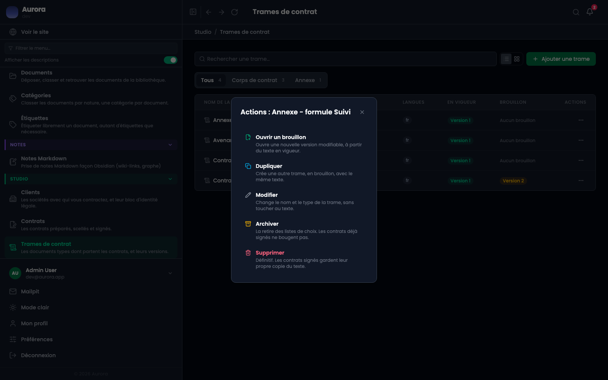
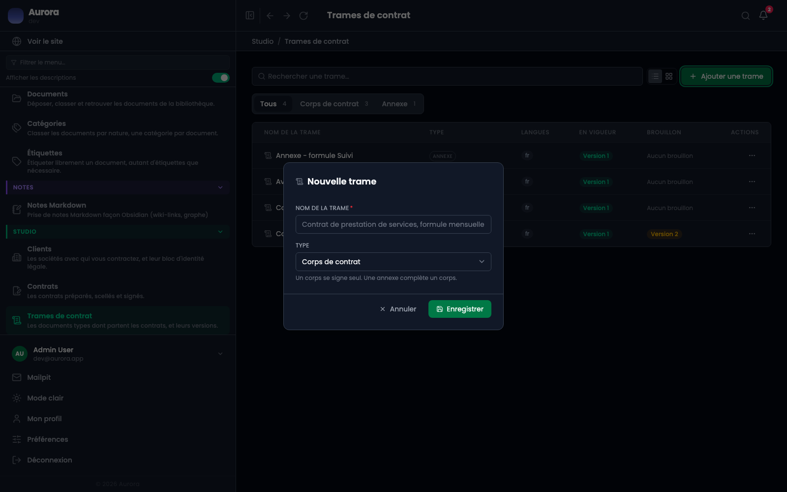

Une trame est un document type. Les contrats en partent, mais n'en dépendent plus une fois scellés : chacun garde sa propre copie du texte.

## 1. La liste

Studio → Trames de contrat. Chaque ligne montre le type, les langues écrites, la version **en vigueur** et le **brouillon** en cours s'il y en a un. Une trame sans version publiée ne peut pas servir à préparer un contrat.

## 2. Corps ou annexe

Le filtre sépare les deux types. Un **corps** porte le texte contractuel ; une **annexe** porte ce qui varie d'une offre à l'autre. Un contrat prend un corps, et facultativement une annexe : l'écran de préparation refuse d'inverser les deux.

## 3. Les cinq actions

- **Ouvrir un brouillon** crée une nouvelle version modifiable, à partir du texte en vigueur.
- **Dupliquer** crée une autre trame, en brouillon, avec le même texte.
- **Modifier** change le nom et le type, sans toucher au texte.
- **Archiver** la retire des listes de choix ; les contrats déjà signés ne bougent pas.
- **Supprimer** est définitif, et les contrats signés gardent leur propre copie du texte.

Ces deux dernières phrases sont la clé du modèle : ce qui a été signé ne dépend plus de la trame.

## 4. Créer une trame

Un nom et un type. Le texte s'écrit ensuite, dans la première version, qui naît en brouillon.

