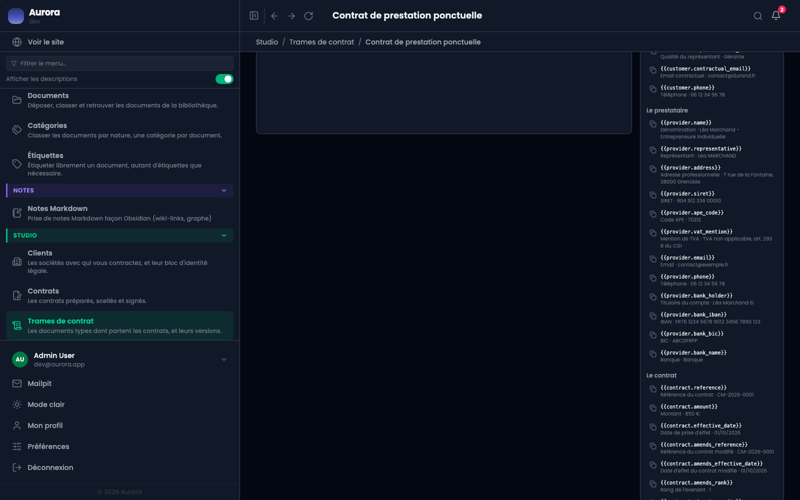
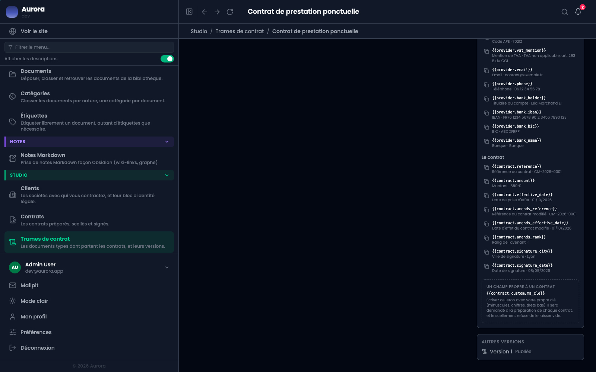

Un jeton est un trou dans le texte, que le contrat remplira. Il s'écrit entre doubles accolades, et le panneau de droite les liste tous avec un exemple de ce qu'ils donneront.

## Les quatre familles

- **customer.*** : le bloc d'identité du client, recopié depuis sa fiche au moment du scellement.
- **provider.*** : votre identité, lue dans les réglages de Studio. Douze jetons, dont les coordonnées bancaires.
- **contract.*** : la référence, le montant, les dates, et pour un avenant la référence et la date du contrat modifié.
- **contract.custom.*** : les blancs que vous inventez.

## Les blancs propres à un contrat

Écrivez `{{contract.custom.ma_cle}}` avec votre propre clé, en minuscules, chiffres et tirets bas. Le champ sera demandé à la préparation de chaque contrat qui utilise cette trame, et **le scellement refuse de le laisser vide**.

C'est ce qui permet à une même trame de servir pour des prestations dont la durée, la formule ou le périmètre changent, sans écrire une trame par cas.

## Ce qui bloque au scellement

- Un jeton que la trame nomme et que rien ne remplit : le document partirait avec un trou.
- Un jeton `provider.*` dont le réglage correspondant est vide.
- Un blanc `custom` laissé vide à la préparation.

Le refus tombe au scellement et pas à l'écriture, parce qu'un texte se travaille par morceaux : c'est au moment de figer qu'il doit être complet.
