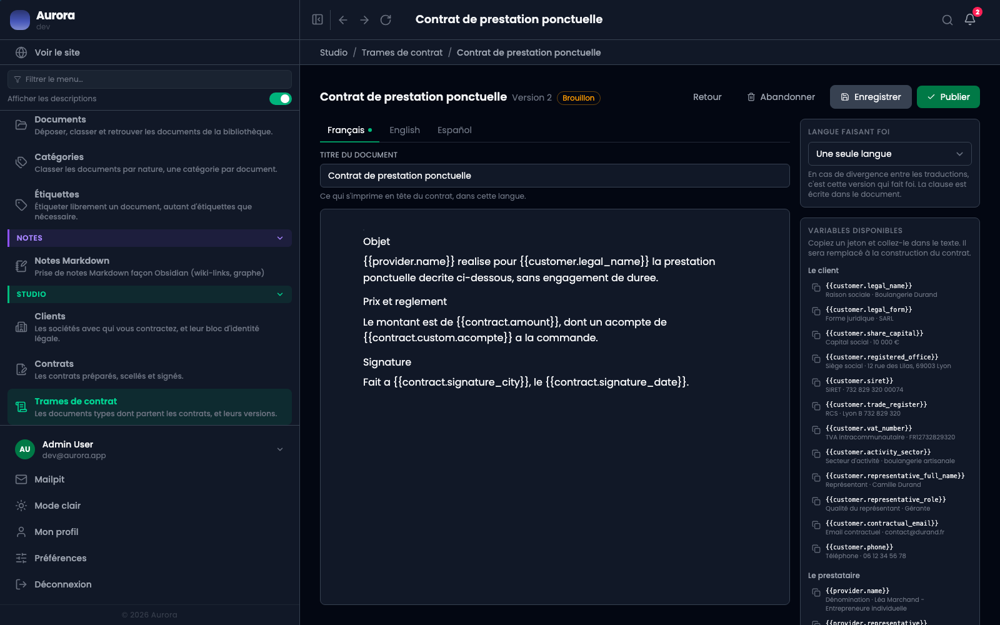

Une trame peut être écrite en plusieurs langues. Dès qu'elle l'est, il faut dire laquelle prévaut, parce que deux traductions ne disent jamais exactement la même chose.

## Où ça se règle

Dans l'éditeur de version, panneau de droite, au-dessus de la liste des jetons. Trois choix : une seule langue, ou l'une des langues écrites.

## Quand elle devient obligatoire

À la publication, et seulement si la version a **plus d'une traduction**. Une version monolingue n'a rien à arbitrer, donc le champ reste sur « une seule langue » sans rien bloquer.

La publication est le dernier moment pour poser la question : à partir de là le texte est immuable, et un contrat scellé sur cette version porterait deux documents d'égale autorité sans moyen de trancher un désaccord.

## Ce qu'elle devient dans le contrat

Elle est scellée avec le reste, et la clause correspondante est écrite dans le document. Le client lit donc noir sur blanc quelle version prévaut, ce qui est le seul endroit où cette information a une valeur.

## Ce que ça refuse

Publier une version bilingue sans langue faisant foi. Le message tombe sur le champ, à la publication.
