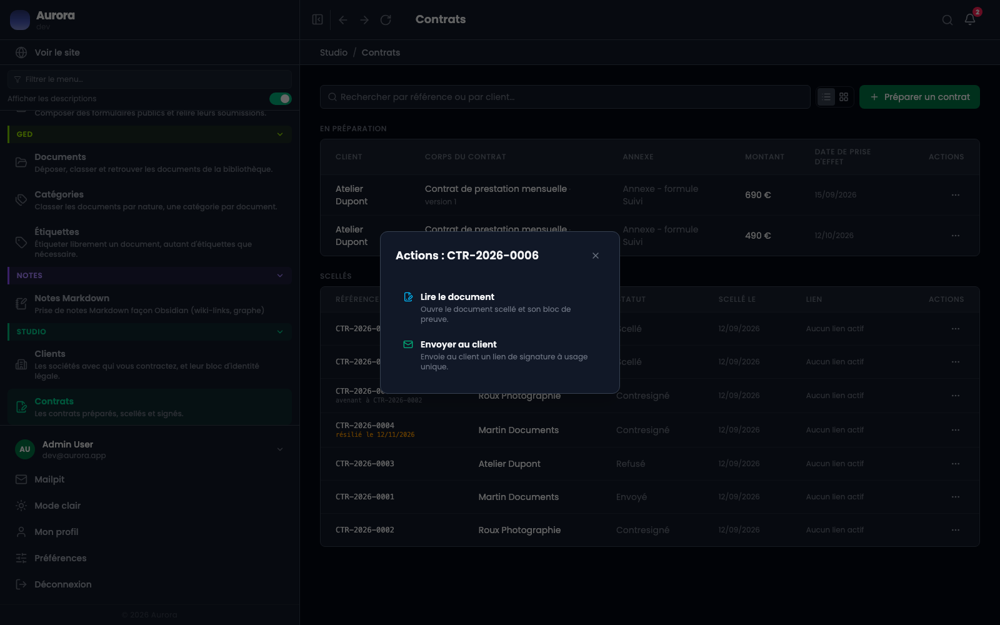
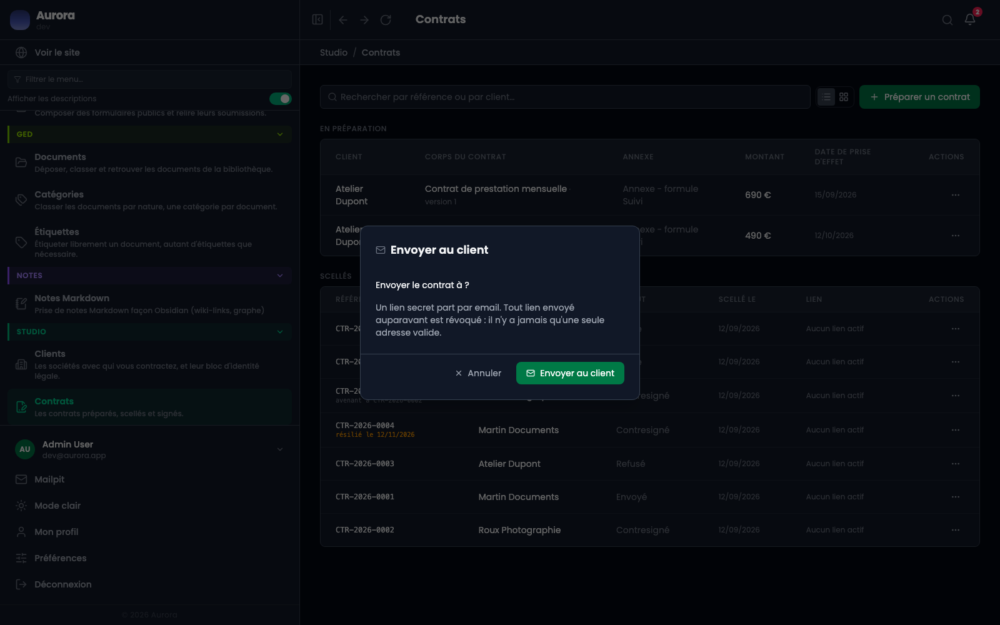
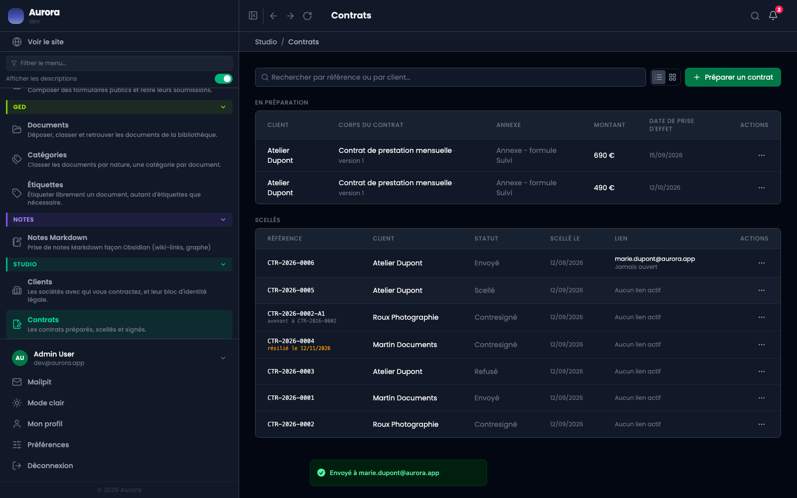

Le contrat est scellé. Il faut maintenant que le client le lise et le signe, et ça passe par une adresse qu'on lui envoie par e-mail.

## 1. Le menu d'un contrat scellé

Un contrat scellé n'offre plus les mêmes actions qu'un brouillon : ni modification, ni suppression. Deux entrées seulement, lire le document et l'envoyer au client.

## 2. La confirmation d'envoi

Elle rappelle à quelle adresse le lien va partir : celle que porte la **fiche du client**, pas une adresse saisie ici. C'est ce qui donne sa valeur au code de confirmation envoyé plus tard.

## 3. Le lien devient actif

La liste affiche l'adresse à laquelle le lien est parti, et la date à laquelle le client l'a ouvert la première fois. Un contrat sans lien actif affiche « Aucun lien actif ».

- Le lien est à **usage unique** au sens où un renvoi en crée un nouveau et annule le précédent.
- Il peut être **révoqué** : le lien cesse de fonctionner, et les codes de confirmation en cours tombent avec lui.
- Une adresse inconnue, révoquée ou expirée donne toutes la même page. Les distinguer dirait à un inconnu quelles tentatives ont porté.

## Si l'e-mail ne part pas

Rien à reprendre sur le contrat : l'écran a fait son travail, l'envoi se fait derrière. Un site où tout répond mais dont aucun e-mail n'arrive a un problème technique, pas un problème de contrat.

## Et ensuite

Le client ouvre le lien et arrive sur la page de signature. Rien ne vous est demandé jusqu'à la contresignature.
