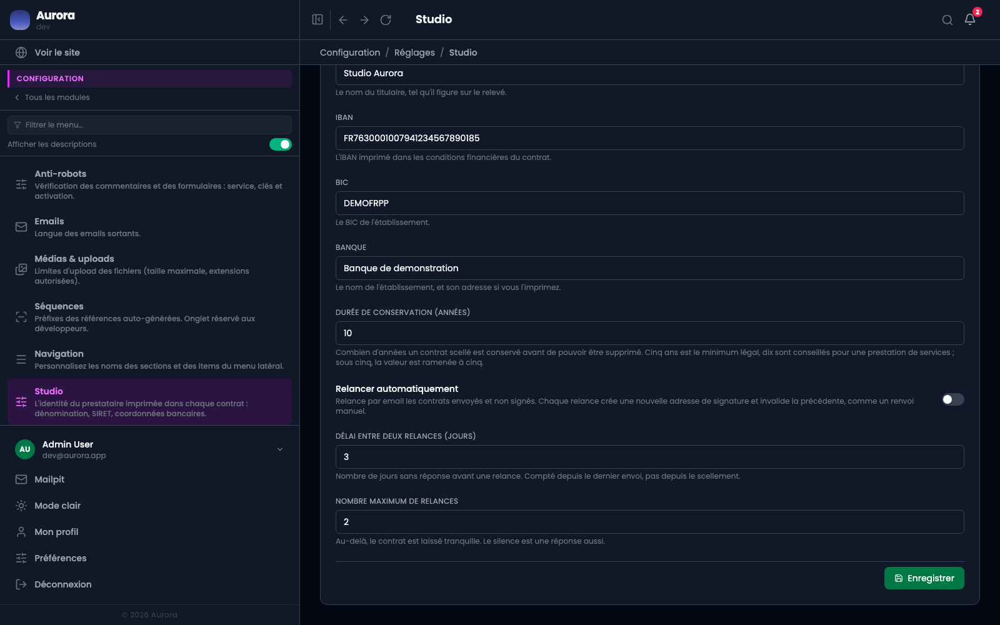
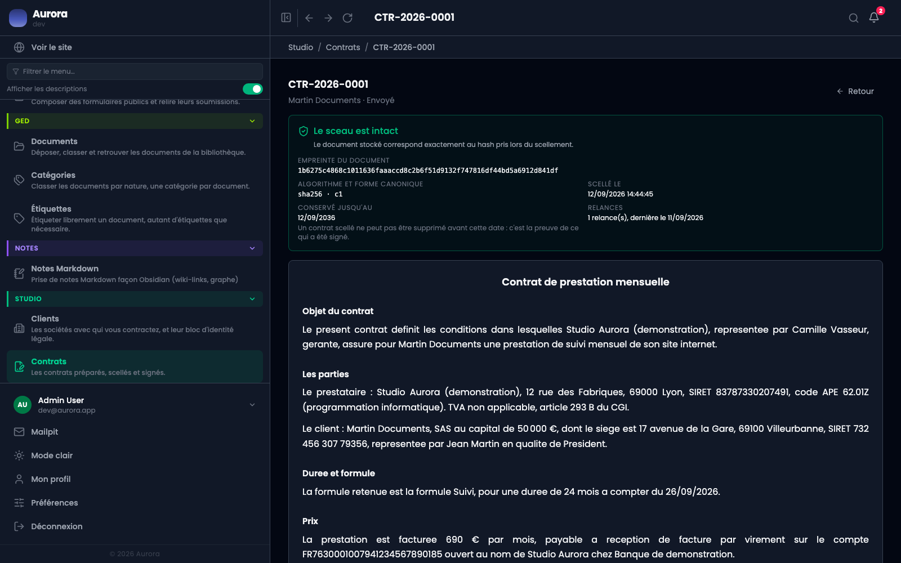

Un contrat envoyé et non signé peut être relancé tout seul, par e-mail. C'est éteint par défaut.

## Les trois réglages

- **Relancer automatiquement** : l'interrupteur.
- **Délai entre deux relances** : le nombre de jours sans réponse avant une relance, compté depuis le dernier envoi et non depuis le scellement.
- **Nombre maximum de relances** : au-delà, le contrat est laissé tranquille.

## Ce qu'une relance fait vraiment

Elle **crée une nouvelle adresse de signature et invalide la précédente**, exactement comme un renvoi manuel. Un client qui avait gardé le premier lien devra utiliser le nouveau.

## Ce qui n'est jamais relancé

- Un contrat déjà signé ou contresigné.
- Un contrat refusé.
- Un contrat dont le lien a été révoqué.
- Un contrat au-delà du plafond de relances.

Le compteur se lit sur la page du contrat, à côté du bloc de preuve.

## Quand les relances ne partent pas

Les relances sont automatiques, et le compteur sur la page du contrat dit combien sont parties. S'il ne bouge plus alors que la date est dépassée, l'envoi automatique est en panne : c'est technique, il n'y a rien à corriger sur le contrat.
