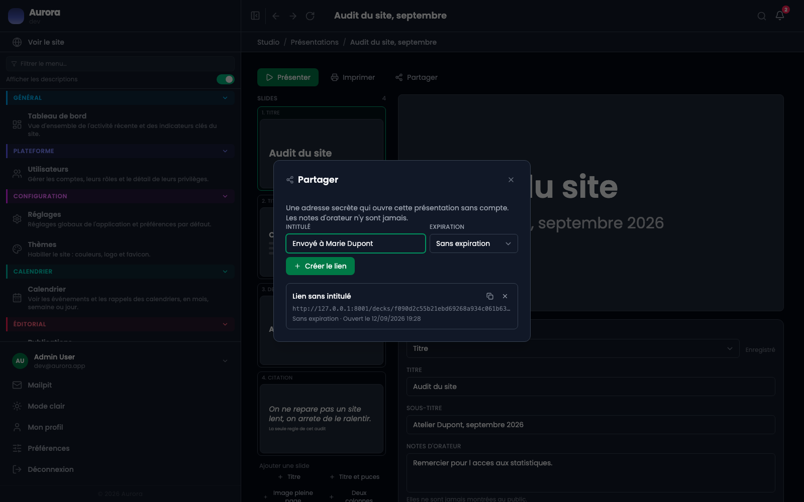
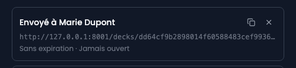
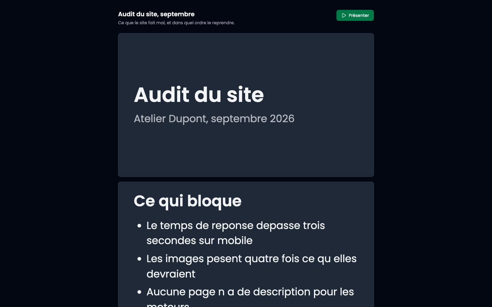

Le bouton « Partager » crée une adresse qui ouvre la présentation sans compte. C'est ce qu'on envoie à un client après un rendez-vous.

## 1. Créer un lien

Un intitulé libre, une expiration facultative, et le lien apparaît dans la liste.

## L'intitulé sert à vous, pas au destinataire

Il n'apparaît nulle part sur la page publique. Il est là pour que la liste reste lisible dans six mois : « envoyé à Marie le 12 septembre » vaut mieux que trois adresses identiques.

## 2. Copier et envoyer

L'icône de copie met l'adresse dans le presse-papiers. Si le navigateur refuse le presse-papiers, l'adresse s'affiche en clair à la place du libellé, à sélectionner à la main.

## 3. Ce que voit le destinataire

Le titre, la description, et les slides les unes sous les autres. Un bouton « Présenter » ouvre le même plein écran que le vôtre.

## Vos notes n'y sont jamais

Les notes d'orateur ne partent pas avec le lien. Elles ne sont pas masquées à l'affichage, elles ne sont pas envoyées du tout.

## La vue est vivante, pas figée

Corriger une faute change ce que voit le destinataire quand il rouvre le lien. C'est ce qu'on attend d'un document partagé, et c'est aussi pourquoi l'expiration existe : un partage oublié continue de publier ce qu'on écrit dans la présentation ensuite.

## 4. Révoquer

L'icône en croix révoque le lien. **La ligne n'est pas supprimée**, elle est estompée : « qui pouvait ouvrir ceci, et jusqu'à quand » est une question à laquelle on veut pouvoir répondre après coup.

Un lien révoqué, expiré ou inventé donne la même réponse : page introuvable. Distinguer les trois confirmerait à quelqu'un qui tâtonne que l'adresse était bonne.

## Savoir s'il a été ouvert

Chaque ligne indique la date de première ouverture, ou « Jamais ouvert ». C'est l'essentiel de ce qui justifie de garder un lien par destinataire plutôt qu'une adresse unique.
