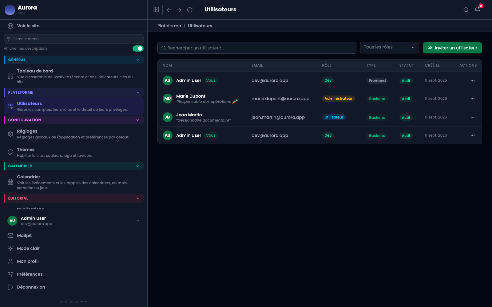
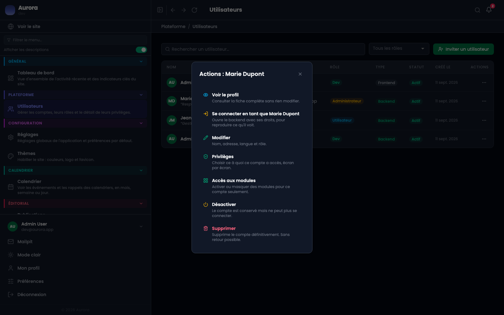
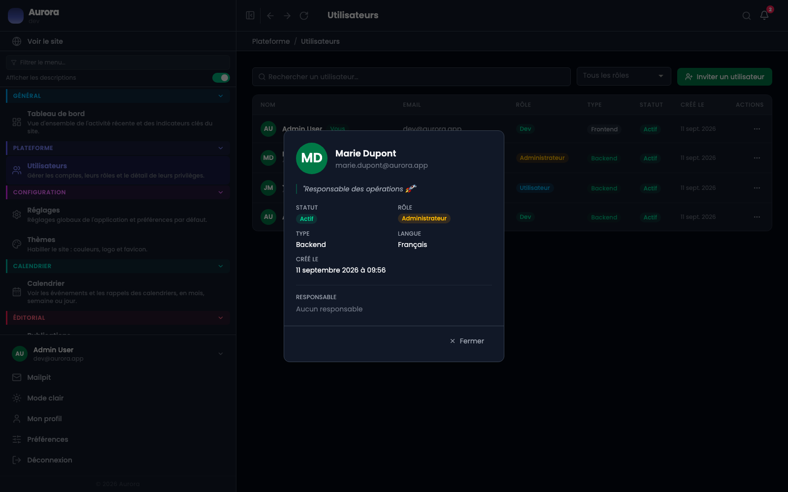

Donner un accès à quelqu'un ne devrait pas vouloir dire lui donner tout. Un compte porte un rôle, un type d'accès, un statut et une liste de privilèges.

## La liste

Une ligne par compte, avec son rôle, son type, son statut et sa date de création. La recherche porte sur le nom et l'adresse, la liste déroulante filtre par rôle.

## Les trois rôles

- Utilisateur : le rôle de base.
- Administrateur : le rôle courant pour quelqu'un qui tient le site.
- Développeur : ajoute l'accès à la section Administration.

## Les deux types d'accès

Back-office ou site public. Un compte de site n'entre pas dans l'administration, même avec un mot de passe valide : le type est vérifié à la connexion. La même personne peut avoir les deux, et la liste les montre alors sur deux lignes.

## Les quatre statuts

- Actif.
- Invité : l'invitation est partie, elle n'a pas encore été acceptée.
- En attente de vérification : l'adresse e-mail n'est pas confirmée.
- Désactivé : le compte existe et ne peut plus entrer.

## Ce qu'on fait d'une ligne

« Désactiver » conserve le compte et lui ferme la porte. C'est ce qu'il faut préférer à la suppression quand quelqu'un part : les contenus qu'il a écrits gardent leur auteur.

## La fiche

« Voir le profil » ouvre la fiche en lecture, sans risque de modifier quoi que ce soit en la consultant.

