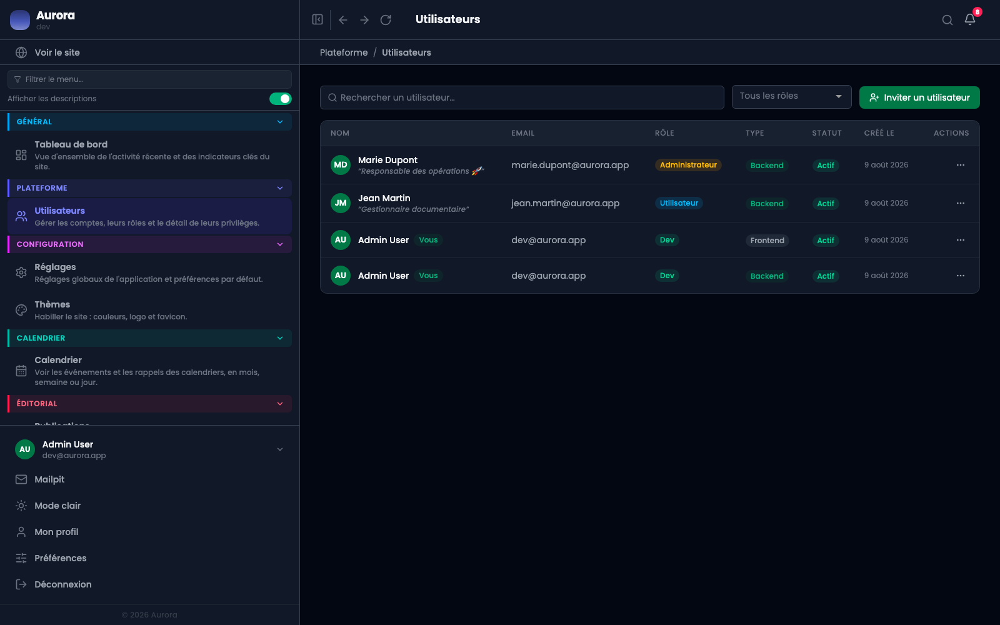

Donner un accès à quelqu'un ne devrait pas vouloir dire lui donner tout. Un compte porte un rôle, un type d'accès, un statut et une liste de privilèges.

## Les trois rôles

- Utilisateur : le rôle de base.
- Administrateur : le rôle courant pour quelqu'un qui tient le site.
- Développeur : ajoute l'accès à la section Administration, dont l'audit et les modules.

## Les deux types d'accès

Back-office ou site public. Un compte de site n'entre pas dans l'administration, même avec un mot de passe valide : le type est vérifié à la connexion.

## Les quatre statuts

- Actif.
- Invité : l'invitation est partie, elle n'a pas encore été acceptée.
- En attente de vérification : l'adresse e-mail n'est pas confirmée.
- Désactivé : le compte existe et ne peut plus entrer.
