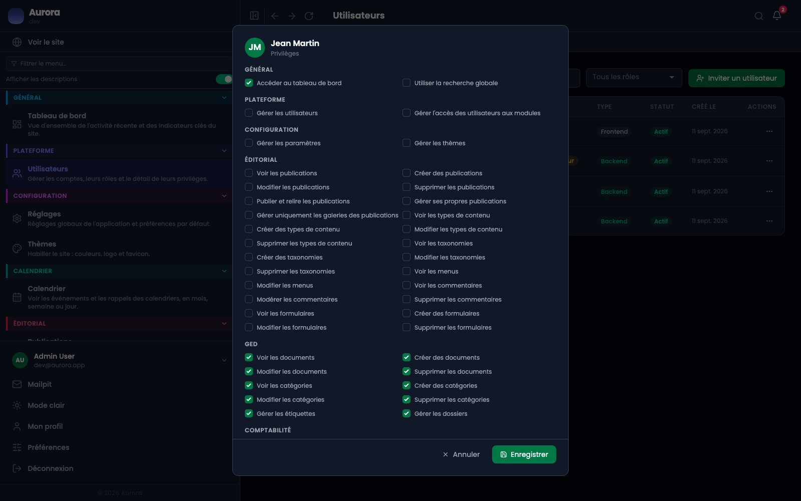

Le rôle décide de la catégorie, le privilège décide de l'écran. C'est le second qui fait le travail au quotidien.

## La fenêtre

Elle s'ouvre depuis les actions d'un compte, et range les privilèges par module.

## Comment ils sont formés

Un privilège nomme un module, un écran et une action : voir, créer, modifier, supprimer, ou gérer quand l'écran ne se découpe pas.

## Ce qu'ils commandent

- Le menu latéral ne montre que ce qui est ouvert au compte.
- L'écran lui-même refuse, même atteint par son adresse.
- La recherche globale filtre ses résultats de la même façon.

## Le cas éditorial

Un compte qui ne peut gérer que ses propres publications ne voit que les siennes partout : la liste, la recherche, les résultats. Un écran qui montrerait ce que la liste refuse serait une fuite.
