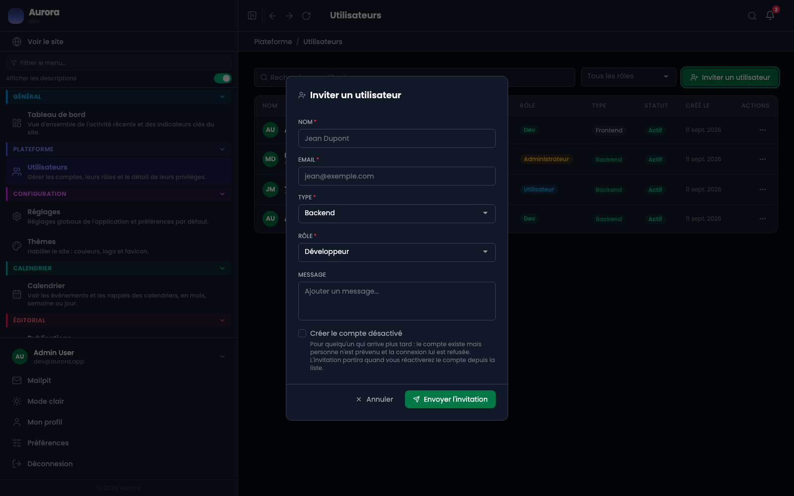

Une invitation crée le compte et laisse la personne poser son propre mot de passe. Personne n'a donc à transmettre un mot de passe provisoire, ni à en inventer un.

## Le panneau

Un nom, une adresse, le type d'accès et le rôle. Les privilèges ne se règlent pas ici : ils se posent après, depuis les actions du compte.

## Le parcours

- Le compte est créé avec son rôle et son type, au statut invité.
- Un e-mail part avec un lien à usage unique.
- La personne pose son mot de passe, et le compte devient actif.

## Inviter quelqu'un qui arrive plus tard

« Créer le compte désactivé » prépare le compte sans envoyer l'invitation. Elle partira à la réactivation, depuis la liste. C'est ce qu'il faut cocher pour une arrivée annoncée mais pas encore effective.

## Ce qu'il faut savoir

Le lien expire. Passé ce délai, il faut renvoyer une invitation : le compte reste en attente entre-temps et ne peut pas entrer.
