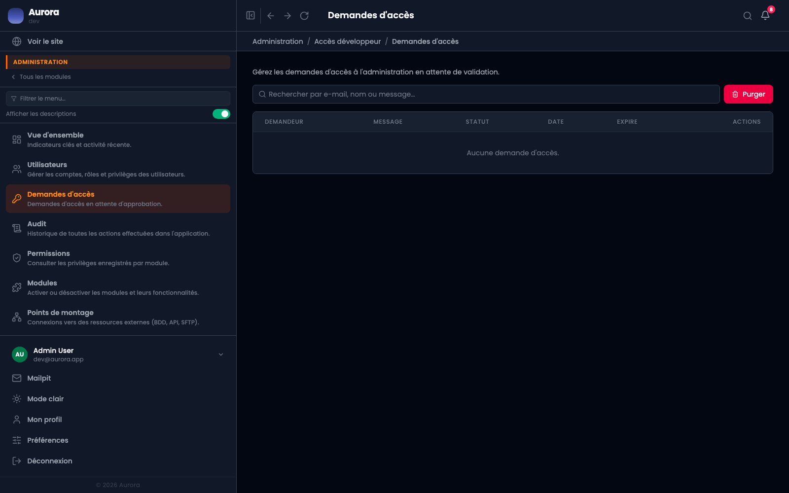

L'inverse de l'invitation : c'est la personne qui demande, et quelqu'un approuve.

## S'en servir

- Le formulaire s'active dans les réglages, groupe Système. Éteint, la page n'existe pas.
- Les demandes arrivent dans la section Administration.
- Approuver crée le compte et envoie l'invitation ; refuser ferme la demande.
- Les demandes traitées se purgent d'un geste.

## Quand l'ouvrir

Rarement. Sur un site à quelques rédacteurs, l'invitation suffit et ne laisse pas une porte ouverte à remplir de demandes indésirables.
