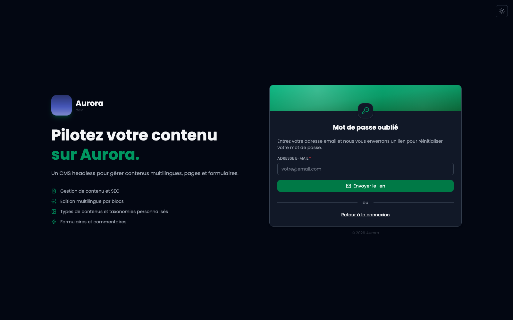
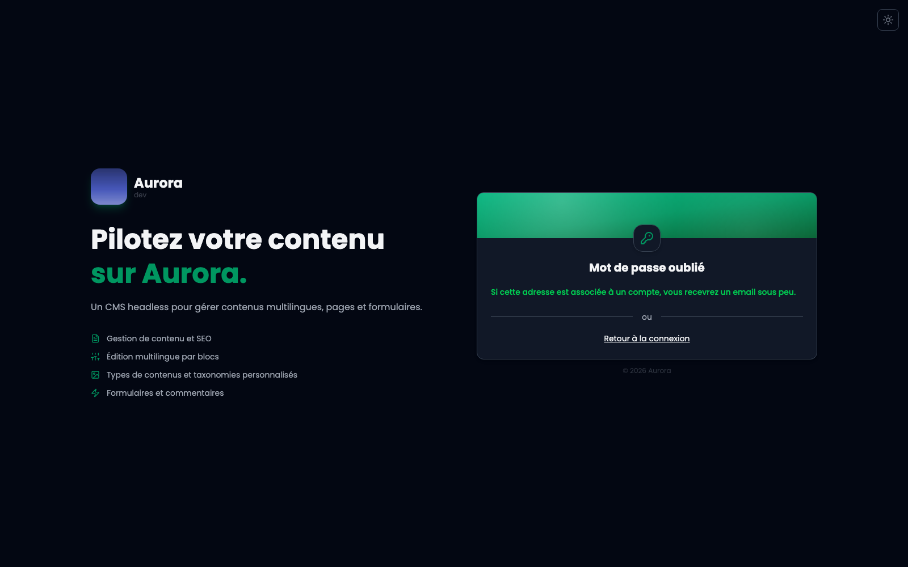

La page est accessible depuis l'écran de connexion, sans être connecté.

## La réponse est toujours la même

« Si cette adresse est associée à un compte, vous recevrez un email sous peu. » Elle s'affiche que l'adresse existe ou non, et c'est délibéré : une réponse qui distinguerait les deux cas dirait à n'importe qui quelles adresses ont un compte sur le site.

## Le lien reçu

À usage unique, et il expire. Une fois le nouveau mot de passe posé, les liens précédents ne valent plus rien.
