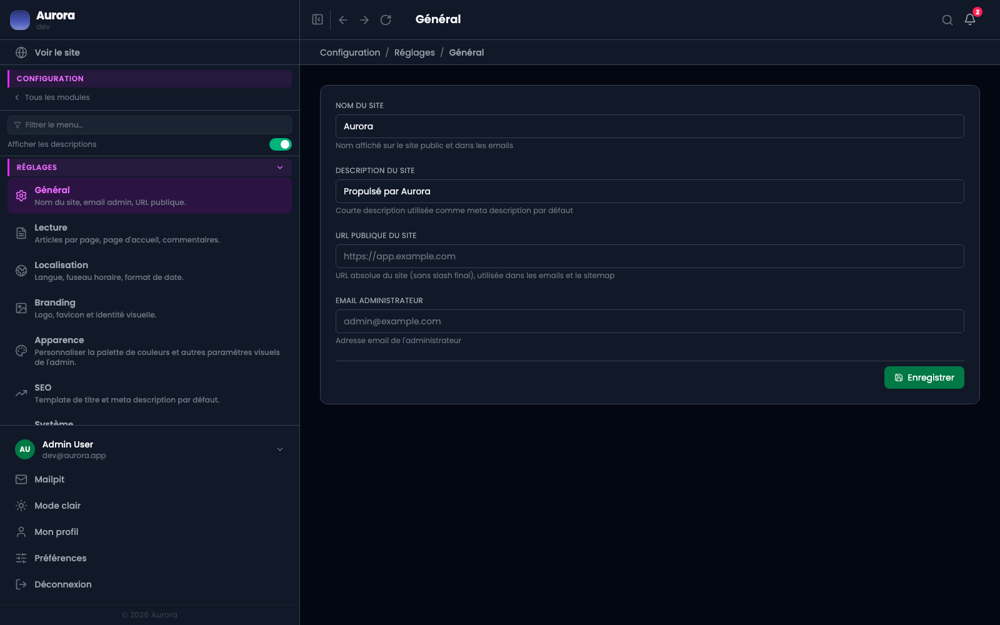

Une centaine de réglages, rangés en onglets. Chacun tient sur un écran, et cette page dit lequel ouvrir.

## Les quatorze

- **Général** : le nom du site, son adresse publique, l'e-mail de l'administrateur.
- **Localisation** : langue, fuseau horaire, format de date.
- **Lecture** : ce que le visiteur voit en premier, et combien.
- **Branding** : logo et favicon.
- **Apparence** : la palette du sélecteur de couleur.
- **SEO** : les valeurs de référencement par défaut.
- **Emails** : la langue des messages sortants.
- **Système** : maintenance, inscriptions, connexions.
- **Navigation** : renommer et réordonner le menu latéral.
- **Comptabilité** : l'identité du prestataire et les règles de contrat.
- **Notes** : la taille et la qualité des images déposées dans une note.
- **Pexels** : la banque de photos libres de droits.
- **Anti-robots** : la protection des formulaires publics.
- **Stockage des fichiers** : où sont écrits vos fichiers, sur le serveur ou ailleurs.

## Deux onglets que vous ne verrez pas

« Médias & uploads » et « Séquences » sont réservés au développeur du site. Le premier tient les limites de dépôt, le second les préfixes des références automatiques. Ce sont des réglages qu'on ne touche pas en exploitation courante, et une valeur mal posée s'y voit longtemps après.

## Un réglage survit aux mises à jour

C'est le produit qui les connaît, pas un fichier posé à côté. Les réglages manquants sont créés et les obsolètes retirés à chaque mise à jour, sans rien perdre de ce qui a été saisi.
