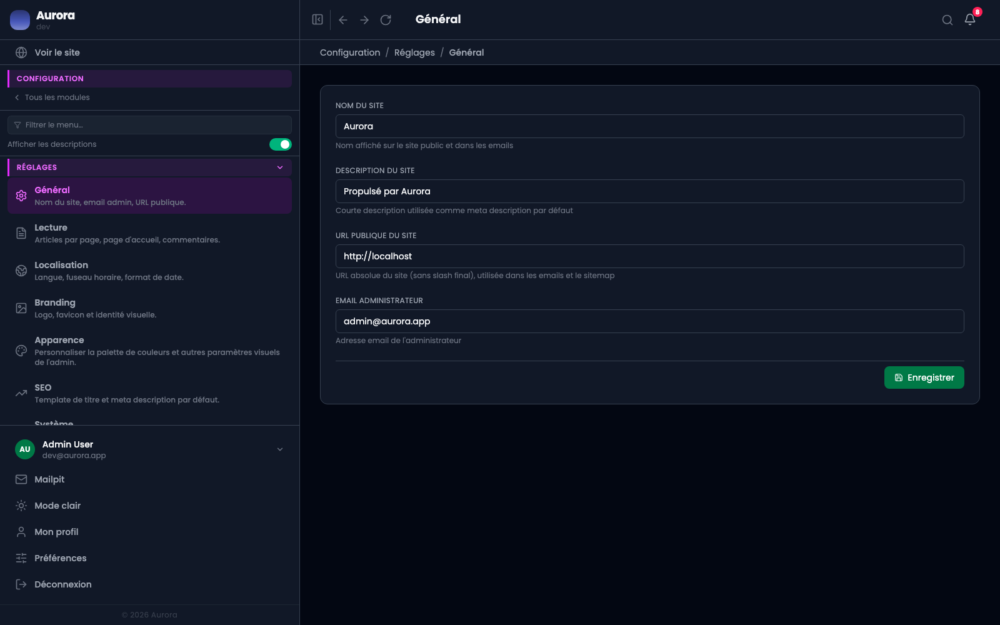

Une centaine de réglages, rangés en treize groupes. Chacun a son onglet, et cette page dit lequel ouvrir.

## Les treize

- Général : le site lui-même. Localisation : langues, fuseau, dates.
- Lecture : ce que le visiteur voit en premier et combien. Médias : les limites de dépôt.
- Marque : logo et favicon. Apparence : la palette du sélecteur de couleur.
- Référencement : les valeurs par défaut. E-mail : la langue et l'expéditeur.
- Système : maintenance, inscriptions, connexions. Séquences : les préfixes de référence.
- Navigation : renommer et réordonner le menu. Modules : les trente bascules.
- Comptabilité : l'identité du prestataire et les règles de contrat.

## Un réglage survit aux mises à jour

C'est le produit qui les connaît, pas un fichier posé à côté. Une commande de synchronisation crée les manquants et retire les obsolètes après chaque mise à jour.
