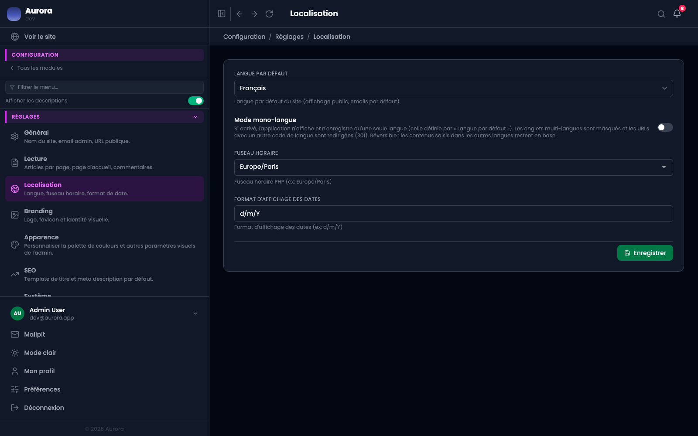

Ce que le site est, et dans quelles langues il parle.

## Général

- Le nom du site et sa description, qui servent au référencement et aux e-mails.
- L'adresse du site, utilisée pour construire les liens dans les e-mails et les flux.
- L'adresse e-mail de l'administration.

## Localisation

- La langue par défaut : celle du site quand rien ne la précise.
- Le mode monolingue, qui retire les onglets de langue de tous les écrans.
- Le fuseau horaire, qui décide de l'heure affichée partout.
- Le format de date.
