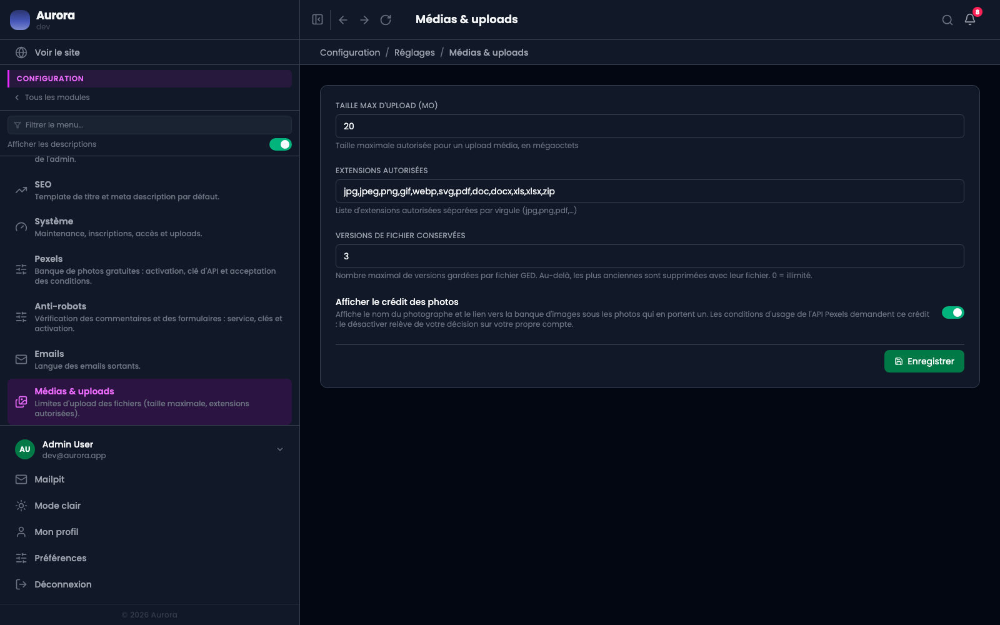

Les limites du dépôt de fichiers, et ce qui s'affiche sous une image.

## Les quatre

- La taille maximale par fichier, vingt méga-octets par défaut.
- Les extensions autorisées, une liste séparée par des virgules.
- Le nombre de versions gardées par document, trois par défaut.
- L'affichage du crédit sous une image qui en porte un.

## Une limite qui n'est pas ici

Le site en a une autre, plus bas, fixée à l'installation. C'est la plus basse des deux qui s'applique : monter celle-ci au-delà ne change rien.
