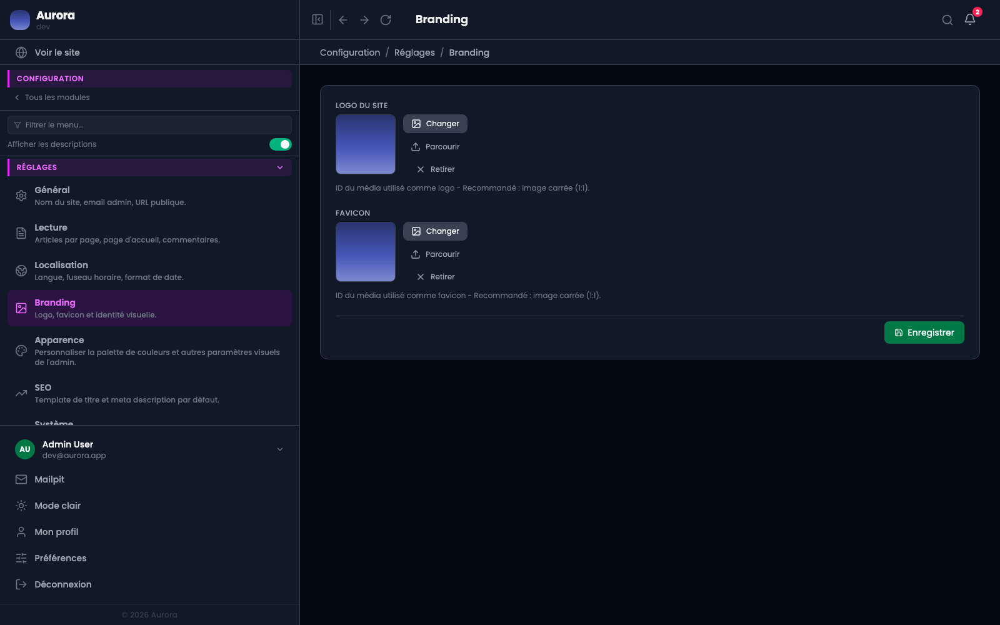

Deux images qui identifient le site, choisies dans la médiathèque plutôt que téléversées ici.

## Où ils servent

- Le logo : en tête du site public, et disponible comme élément d'un bandeau de page.
- Le favicon : l'icône de l'onglet du navigateur.

## Le format

Le favicon gagne à être carré et lisible en très petit. Un logo complet réduit à seize pixels devient une tache : mieux vaut une initiale ou un symbole.
