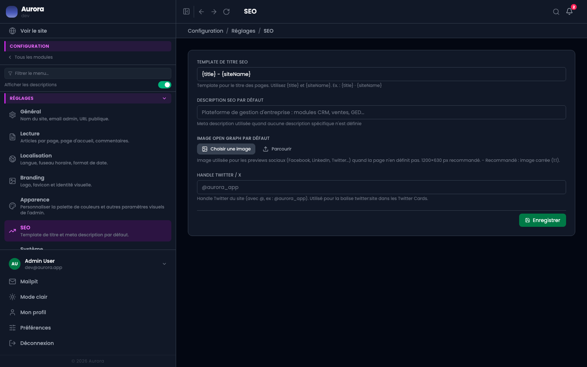

Les valeurs de repli du référencement, utilisées quand une publication laisse son onglet vide.

## Les quatre

- Le gabarit de titre, qui compose le titre d'onglet à partir de celui de la page et du nom du site.
- La description par défaut.
- L'image de partage par défaut.
- Le compte Twitter du site, utilisé dans les balises de partage.

## Le bon usage

Ces valeurs sont un filet, pas une stratégie. Une page qui compte mérite son propre titre et sa propre description.
