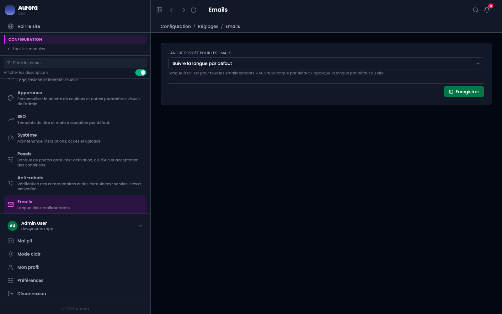

Ce qui décide de la forme des e-mails que le site envoie.

## Les réglages

- La langue des e-mails, qui peut différer de celle du site.
- L'adresse d'expédition, dans le groupe Général.

## En développement

Les e-mails ne partent pas vraiment : ils s'ouvrent dans une boîte locale, accessible depuis le menu. C'est là qu'on vérifie un lien de signature ou une invitation sans importuner personne.
