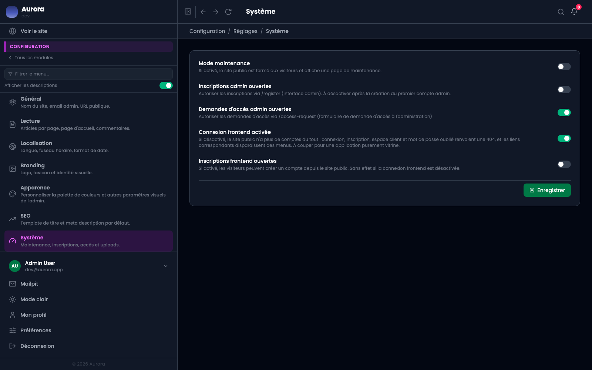

Cinq interrupteurs qui décident de ce que le site accepte.

## Les cinq

- Le mode maintenance.
- L'inscription depuis l'administration.
- Le formulaire de demande d'accès.
- La connexion depuis le site public.
- L'inscription depuis le site public.

## Le mode maintenance

Les visiteurs voient une page d'attente ; un compte identifié continue de naviguer. C'est ce qui permet de vérifier le site pendant qu'il est fermé. Il se coupe depuis le même écran, donc mieux vaut rester connecté avant de l'activer.
