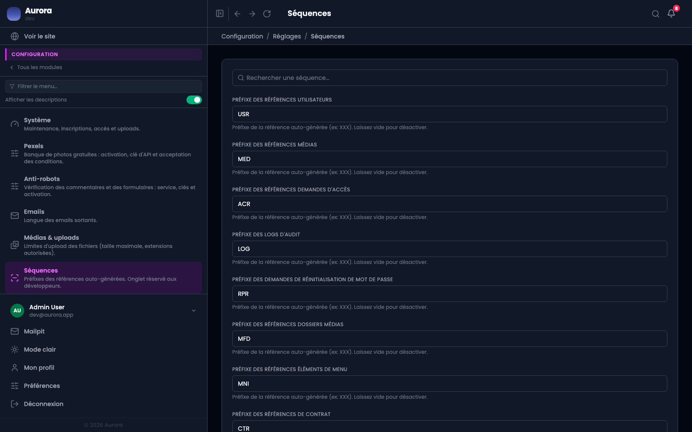

Plusieurs objets portent une référence lisible : un contrat, un document, un utilisateur, une entrée d'audit. Le préfixe se règle.

## Les huit

Utilisateur, document de la médiathèque, dossier, entrée de menu, réinitialisation de mot de passe, demande d'accès, entrée d'audit, contrat.

## Ce que renommer change

Rien pour les références déjà émises : elles gardent l'ancien préfixe. Seules les suivantes prennent le nouveau. Un export contiendra donc les deux, ce qui est normal et se lit sans ambiguïté.

## La séquence

Le compteur est annuel pour les contrats. Il n'est jamais réutilisé, même après suppression : un trou dans la numérotation est préférable à deux objets sous le même numéro.
