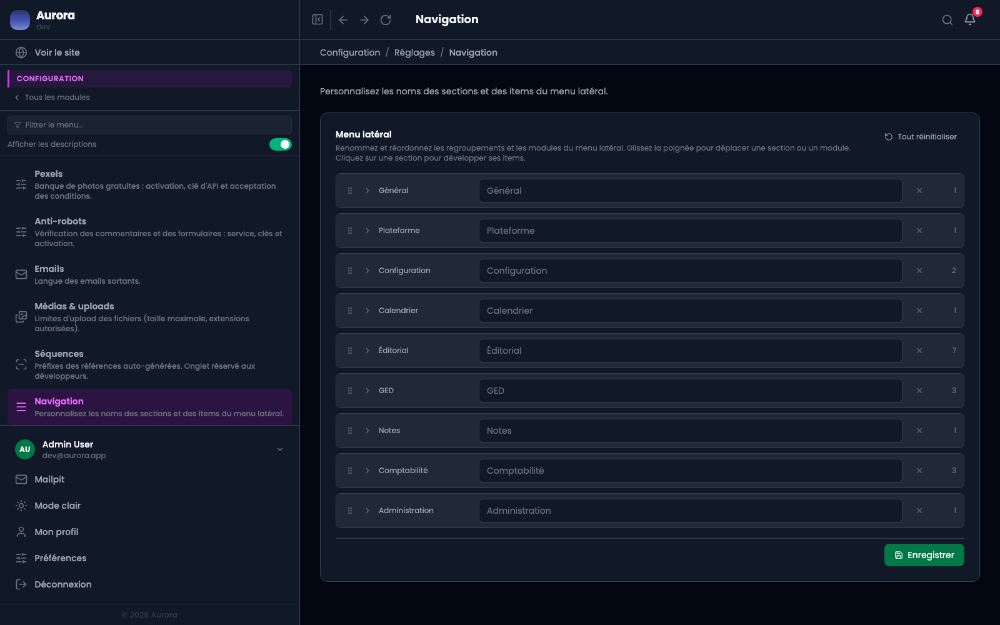

Le vocabulaire d'Aurora n'est pas celui de tous les métiers. Les sections et les entrées du menu se renomment.

## Ce qui se règle

- Un autre nom pour une section, ou pour une entrée.
- Un autre ordre pour les sections et pour les entrées.

## Pour tout le monde

C'est une décision de vocabulaire pour le site : elle s'applique à chaque compte. Ce que chacun masque ou recolore pour lui seul est ailleurs, dans son profil.
