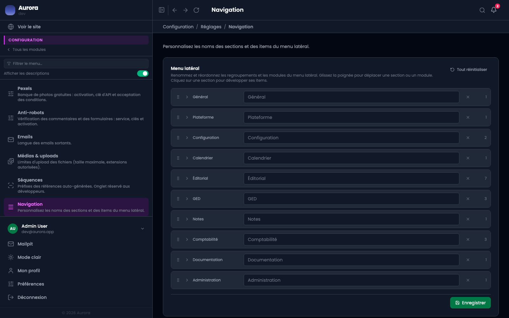

Le vocabulaire d'Aurora n'est pas celui de tous les métiers. Les sections et les entrées du menu se renomment.

## Ce qui se règle

- Un autre nom pour une section, ou pour une entrée. Le champ affiche le nom d'origine en filigrane : vide, c'est lui qui s'applique.
- Un autre ordre, en tirant la poignée à gauche de la ligne.
- Le chiffre à droite dit combien d'entrées la section contient ; la flèche la déplie pour les renommer une à une.
- « Tout réinitialiser » rend au menu ses noms et son ordre d'origine.

## Pour tout le monde

C'est une décision de vocabulaire pour le site : elle s'applique à chaque compte. Ce que chacun masque ou recolore pour lui seul est ailleurs, dans son profil.
