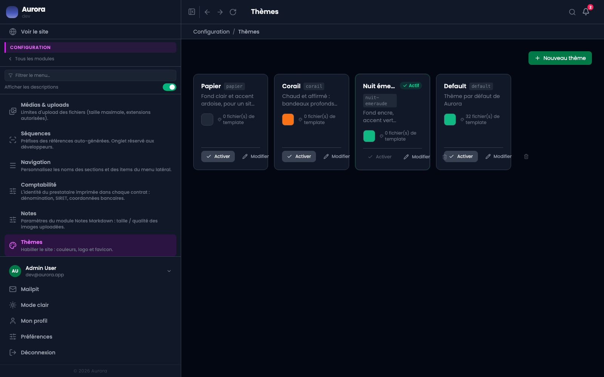
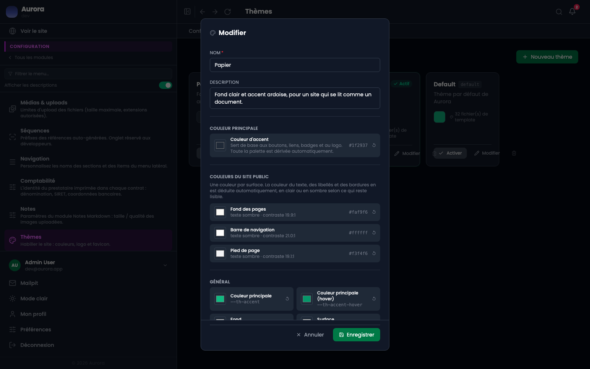

L'habillage du site ne demande pas de toucher au code. Un thème porte sa palette, on l'active, et le site public change.

## L'éditeur

« Modifier » ouvre la palette du thème.

## Ce que porte un thème

- Une **couleur d'accent**, dont toute la palette est dérivée : boutons, liens, badges, logo.
- Une couleur par surface du site public : le fond des pages, la barre de navigation, le pied de page.
- Le nom du thème, et son état actif ou non.

## Le contraste est calculé, pas deviné

Chaque surface affiche le rapport de contraste obtenu et si le texte y sera clair ou sombre. C'est ce qui évite le fond sombre qui emporte des textes sombres : la couleur du texte est déduite de la surface, pas choisie à part.

## Un seul actif

Activer un thème désactive le précédent. Les autres restent enregistrés, ce qui permet de revenir en arrière d'un clic.

## Au-delà de la palette

Un thème peut aussi apporter ses propres gabarits, quand un projet demande une mise en page que la palette ne suffit pas à décrire. Ça, c'est du code, livré avec le thème.
