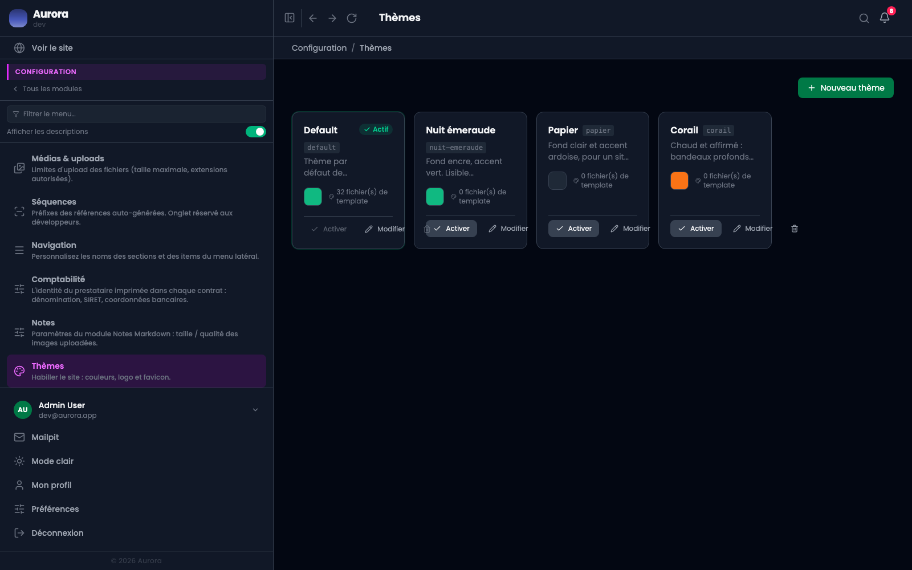

L'habillage du site ne demande pas de toucher au code. Un thème porte sa palette, on l'active, et le site public change.

## Ce que porte un thème

- La couleur d'accent, celle du fond, celles de l'en-tête et du pied de page.
- Les contrastes déduits automatiquement, pour qu'un fond sombre n'emporte pas des textes sombres.
- Le nom du thème, et son état actif ou non.

## Un seul actif

Activer un thème désactive le précédent. Les autres restent enregistrés, ce qui permet de revenir en arrière d'un clic.

## Au-delà de la palette

Un thème peut aussi apporter ses propres gabarits, quand un projet demande une mise en page que la palette ne suffit pas à décrire. Ça, c'est du code, livré avec le thème.
