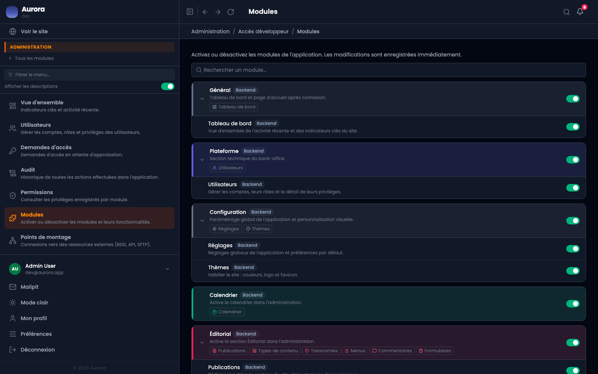

Aurora est un socle avec des modules. Un site vitrine n'a pas besoin d'un calendrier. Ce qui n'est pas utile s'éteint.

## La cascade

Un module a une bascule, et ses écrans en ont chacun une. Couper le module coupe tout ce qu'il contient ; couper un écran laisse les autres. Trente bascules en tout.

## Ce que couper fait

- L'entrée disparaît du menu latéral.
- Les écrans du module refusent, même atteints par leur adresse.
- Le panneau du module disparaît du tableau de bord.
- Le module cesse de répondre à la recherche globale.

## Ce que couper ne fait pas

Rien n'est supprimé. Les données restent, et réactiver le module les retrouve telles quelles.

## Où c'est

Dans la section Administration, réservée au rôle développeur, et protégée par une confirmation de mot de passe : éteindre un module est une décision d'exploitation.
