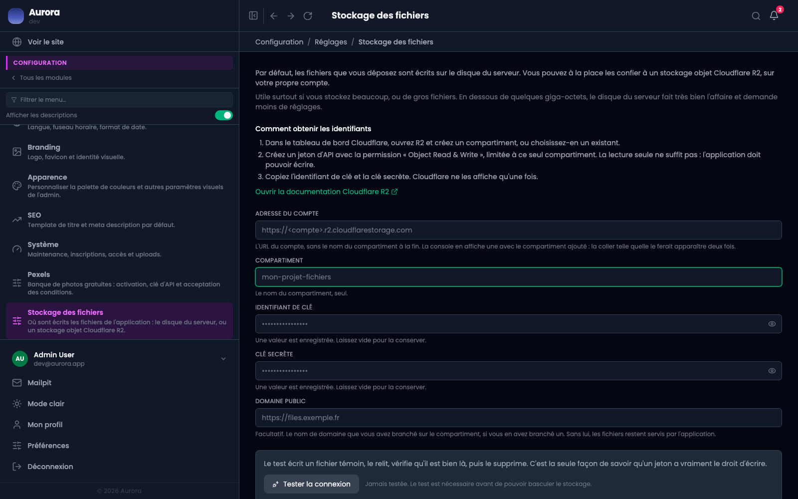

Par défaut, tout ce que vous déposez est écrit sur le disque du serveur. Vous pouvez à la place confier ces fichiers à un stockage objet Cloudflare R2, ouvert à votre nom.

## Faut-il le faire ?

Probablement pas tout de suite. Le disque d'un serveur ordinaire tient des dizaines de milliers de documents sans broncher, et le stockage distant ajoute un compte à gérer, des clés à renouveler et un service de plus qui peut tomber.

Il devient intéressant quand le volume devient réel : des vidéos, des galeries en pleine résolution, des années d'archives. Là, le disque du serveur finit par coûter plus cher que le stockage distant, et les sauvegardes deviennent longues.

Le réglage est réversible, et il ne déplace rien de lui-même. C'est un bon point de départ : allumer, observer, revenir en arrière si besoin.

## Obtenir les identifiants

Sur le tableau de bord Cloudflare, ouvrez **R2** et créez un compartiment, ou choisissez-en un existant. Puis créez un jeton d'API avec la permission **Object Read & Write**, limitée à ce seul compartiment.

La lecture seule ne suffit pas. C'est l'erreur la plus fréquente, et elle est invisible : tout paraît correctement configuré jusqu'au premier dépôt de fichier.

Cloudflare affiche l'identifiant de clé et la clé secrète **une seule fois**, à la création du jeton. Copiez-les avant de quitter la page.

## Ce que l'écran demande

L'**adresse du compte** est l'URL sans le nom du compartiment à la fin. La console Cloudflare en affiche une avec le compartiment ajouté, et coller cette chaîne entière est l'erreur la plus courante : le compartiment se retrouverait deux fois dans chaque requête. Si vous le faites, l'écran retire la partie en trop au moment d'enregistrer, et le champ vous réaffiche l'adresse nettoyée. Vous n'avez rien à faire.

Le **compartiment** se saisit seul, dans son propre champ.

L'**identifiant de clé** fait 32 caractères et la **clé secrète** 64. Si vous en collez une d'une autre longueur, l'écran refuse d'enregistrer et vous dit lequel des deux champs est en cause, en gardant ce que vous avez déjà saisi : il n'y a que le champ fautif à reprendre. Sans cela, l'erreur ne serait venue que de Cloudflare, au moment du test, sous une forme qui ne nomme ni le champ ni l'écran.

Le **domaine public** est facultatif. C'est le nom de domaine que vous auriez branché sur le compartiment. Sans lui, les fichiers continuent d'être servis par l'application, ce qui fonctionne très bien.

## Le bandeau en haut de l'écran

Une ligne, tout en haut, dit si le stockage distant est branché, sur quel compartiment, quand il a été vérifié, et où partent les nouveaux fichiers. C'est la réponse à la question qui amène le plus souvent sur cet écran, sans avoir à lire le formulaire.

Le point d'interrogation à côté ouvre le détail : ce que le test vérifie, ce qui est enregistré, et comment se débrancher.

Si la configuration vient de l'environnement du serveur plutôt que de cet écran, le bandeau le dit. Dans ce cas, les champs affichent ce que le serveur impose et les modifier ici ne change rien.

## Tester avant de basculer

Le bouton **Tester la connexion** est obligatoire, et c'est volontaire. Il ne relit pas vos réglages : il écrit un vrai fichier témoin, le relit, vérifie qu'il apparaît dans la liste, puis le supprime.

C'est la seule façon de savoir qu'un jeton a réellement le droit d'écrire. Quatre champs remplis ne prouvent rien.

Chaque étape est rapportée séparément, parce que « ça ne marche pas » ne dit rien alors que « l'écriture est passée, la relecture a échoué » désigne le problème. Quand une étape échoue, l'écran affiche la chose à aller changer plutôt que le message brut du service, qui ne nomme aucune des causes possibles.

Modifier l'adresse, le compartiment ou une clé annule le test précédent : il portait sur une autre configuration.

## Se débrancher

Le bouton **Débrancher le stockage**, en bas à gauche, efface les deux clés, oublie l'adresse et le compartiment, annule la vérification et ramène les nouveaux fichiers sur le disque du serveur.

C'est le seul geste qui efface une clé. Laisser un champ de clé vide veut dire « garde celle qui est enregistrée », jamais « oublie-la ».

**Rapatriez vos documents avant.** L'écran refuse de se débrancher tant qu'un document vit encore sur le stockage distant, et vous dit combien il en reste : les clés sont le seul chemin vers ces fichiers, les effacer les rendrait inaccessibles.

Cloudflare n'affiche une clé qu'à sa création. Revenir en arrière demande donc de créer un nouveau jeton, pas de retrouver celui-ci.

## Ce que la bascule change, et ce qu'elle ne change pas

Elle ne concerne que les **fichiers à venir**. Ceux déjà déposés ne bougent pas et restent lisibles là où ils sont. Pour en déplacer un, voyez la page du même nom dans la médiathèque.

L'adresse d'un document **ne change jamais**, quel que soit son emplacement ou la façon dont vous choisissez de le servir. C'est important : une image insérée dans une publication garde son adresse dans le texte, et un fichier qui déménage ne casse aucune page.

## Ce que « les fichiers » recouvre

Tout ce que l'application écrit : les documents de la médiathèque avec leurs vignettes et leurs variantes, les photos de profil, et les PDF des contrats signés.

Ce dernier point mérite d'être su. Un contrat scellé est une pièce juridique, et ce réglage décide où sa copie est écrite. Elle reste servie par l'application, derrière l'authentification, quel que soit le mode de livraison choisi ci-dessous : un contrat n'est jamais exposé par un lien public, même quand les images le sont.

## Comment les fichiers sont servis

Trois choix, et seule la réponse de l'application change.

**Par l'application** est le plus simple, et vos règles d'accès continuent de s'appliquer puisque chaque requête passe par elle. Les octets traversent le serveur.

**Par lien signé temporaire** envoie les octets directement du stockage au visiteur, sans que les fichiers deviennent publics. Le lien expire au bout de quelques minutes.

**Par le domaine public** est le plus rapide et le mieux mis en cache, mais les fichiers deviennent lisibles par quiconque connaît leur adresse. Convenable pour des images de publication, à éviter pour des documents sensibles.

## Ce que ça coûte

Le trafic sortant est gratuit chez Cloudflare, contrairement à la plupart des services équivalents. Le stockage et les requêtes, eux, se facturent, avec un palier gratuit généreux qu'une bibliothèque ordinaire ne franchit pas.

Le compte est le vôtre. C'est Cloudflare qui vous facture, et vous qui gérez les clés.
