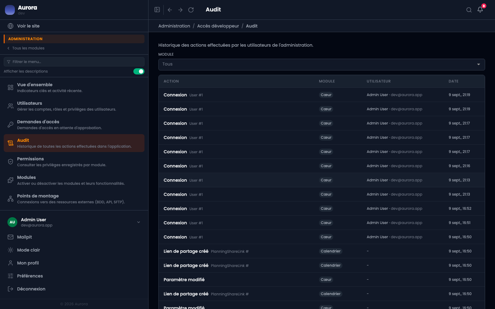

Qui a fait quoi, quand, et sur quel objet. Cent vingt-sept actions sont tracées dans les huit modules.

## Ce que porte une ligne

- L'action, en clair, et l'objet concerné avec son identifiant.
- Le module, ce qui permet de filtrer.
- Le compte et son adresse e-mail, quand l'action vient d'une personne.
- La date et l'heure, et une référence propre à la ligne.

## Ce qui n'est pas tracé

Les lectures. Le journal dit ce qui a changé, pas qui a regardé. Et une action faite par une commande ou une tâche planifiée n'a pas de compte à nommer : la colonne reste vide, ce qui est honnête.

## Journal ou notifications

Le journal est exhaustif et sans opinion ; les notifications ne signalent que ce qui demande une décision. Chercher dans le journal, se laisser prévenir par les notifications.
