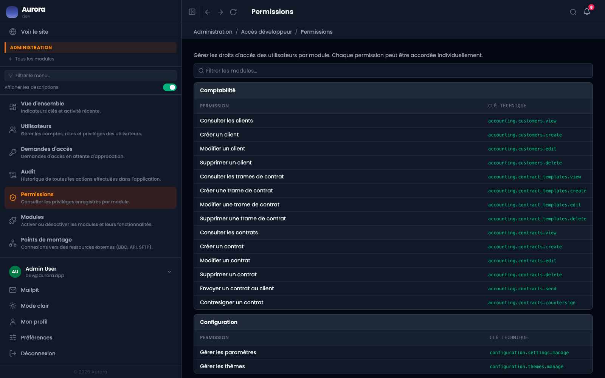

L'écran qui montre tous les privilèges que l'application connaît, groupés par module.

## À quoi il sert

- Savoir ce qui existe avant de composer un profil d'accès.
- Vérifier après une mise à jour ce qui est apparu.

## Comment la liste se remplit

Elle est déclarée en code par chaque module, pas saisie. Une commande de synchronisation retire des comptes les privilèges disparus et signale ceux qui sont nouveaux : c'est elle qui tient la liste à jour après une mise à jour.
