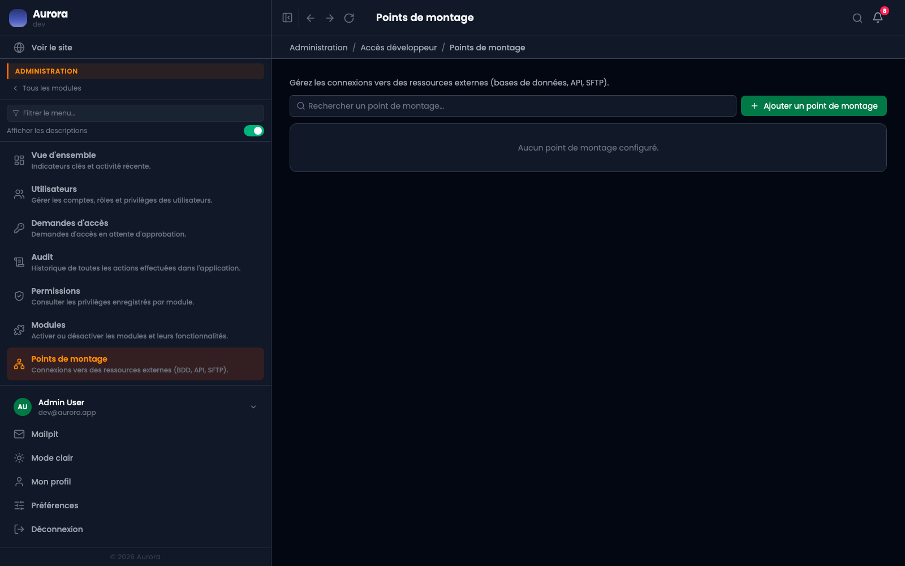

Une base de données, une API ou un SFTP auxquels le site doit parler. Les coordonnées se déclarent ici plutôt que dans un fichier.

## Les trois natures

- Base de données.
- API.
- SFTP.

## Les tester

Chaque point de montage a un bouton d'essai, qui tente la connexion et dit ce qui ne va pas. C'est ce qui permet de distinguer un mot de passe erroné d'un pare-feu fermé sans lire un journal.

## À qui c'est réservé

Au rôle développeur. Ce sont des accès à des systèmes tiers, pas du contenu.
