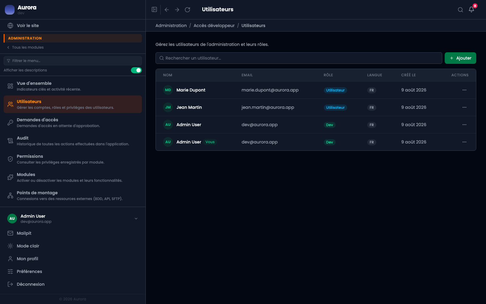

Un second écran de comptes, dans la section Administration, avec deux gestes que l'autre n'a pas.

## Ce qu'il ajoute

- Basculer le rôle développeur, qui ouvre cette section même.
- Supprimer un compte.

## Pourquoi il est à part

Accorder le rôle qui donne accès à l'audit, aux modules et aux points de montage n'est pas une gestion d'équipe : c'est une décision technique. La séparer évite qu'elle se fasse par mégarde depuis l'écran de tous les jours.
